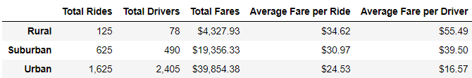
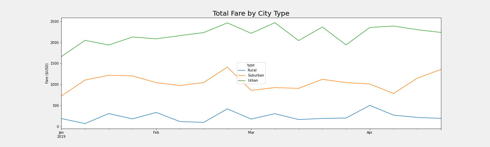

# PyBer Analysis

## Overview
The purpose of this analysis is to explore and vizualise the ride-sharing data of PyBer, in order to improve the publics access to their services and determine affordability for underserved neighbourhoods.

## Results
Taking a look at our dataset, we notice a few things for the year of 2019:
* Urban cities have more than double the total combined rides of rural and suburban cities
* Urban cities have more than quarduple the total combined drivers of rural and suburban cities
* Urban cities have nearly double the combined total fare of for rural and suburban cities

These differences between urban, suburban and rural cities seem consistant throughout the year. Looking at the first quarter, we see that urban cities maintain high total fares compared to other city types, even though rural cities maintain the highest average fare per ride as seen in the table above.

As we can see, urban cities are the largest contributors towards PyBers services, from drivers to rides to fares. Altough these numbers are the largest, bigger does not mean better. Looking closer, we see that there are more drivers than actual rides completed for the 2019 year. The supply does not meet the demand! This acts as a gateway to looking over all the numbers, and although they are better than in urban cities, we see that there is almost two rides for every one driver in suburban and rural areas for the entire year.

### Summary
Reviewing all of our collected data, there is clearly work to be done. One recommended action to improve these numbers would be to reduce rates in rural, as well as suburban cities, which may lead towards higher total rates, much like in urban cities, as more people will be inclined to purchase PyBers services, both from a cost-competitive standpoint as well as an affordability standpoint.
Another course of action would be to increase PyBers presence within all cities, with attention on rural and suburban areas, through advertisement. Having a total of 2,375 throughout the year is a clear indicator that the people do not know about PyBer's amazing services, and therefore do not purchase. This issue is not as present within urban cities as it is with suburban and rural cities, but spreading the PyBer brand should still bring in more clientel no matter where it is done.
Additionally, and perhaps more importantly, opimizing how many drivers are operating overall would lead to greater fares per driver, as well as saves on any costs. Within urban cities, there are more drivers than actual rides taking place throughout the entire year! Urban city drivers are performing on average 0.67 rides for the year of 2019. Suburban and rural cities are not faring any better, as they are averaging 1.27 and 1.60 rides respectively for the entire year of 2019. There are not enough rides being demanded to warrant the need for such an excessive amount of drivers to be available. Looking at competitors, their drivers are performing multiple rides per day. That does not bode well for our single-ride-a-year drivers who would depend on this service for income.
